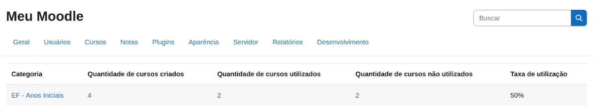
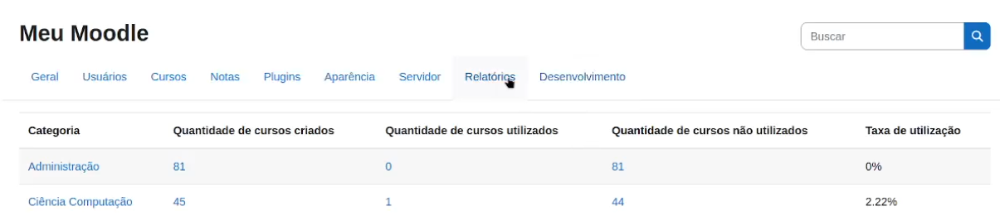

[Voltar](../README.pt-BR.md)

# Utilizando o arquivo de configuração

Este tutorial apresenta um exemplo prático de utilização do arquivo de configuração do plugin "CourseStats". O conteúdo também está disponível em formato de [vídeo](https://www.youtube.com/watch?v=db7qCcLRKmI).

## 1. Introdução
- O arquivo de configuração permite personalizar as categorias e os cursos exibidos no relatório estatístico do plugin "CourseStats", sem alterar a organização original do Moodle. Este guia detalha os passos para criar e configurar o arquivo de forma eficiente.

## 2. Identificando o ID de uma categoria do Moodle
- Para identificar o ID de uma categoria no Moodle:
    - Acesse o menu **Cursos e Categorias**.
    - Clique na categoria desejada e verifique o ID da categoria, exibido na barra de endereços do navegador (Figura 1).


*Figura 1: Identificando o ID de uma categoria no Moodle.*

- No exemplo apresentado no vídeo, foram identificados os seguintes IDs:
    - Categoria **EF - 1º Ano** → ID: 16
    - Categoria **EF - 2º Ano** → ID: 17

## 3. Criando o arquivo de configuração
- Acesse o plugin através do menu **Relatórios** e clique em **[Configurações] Estatísticas de Utilização de Cursos V2**.
- No campo destinado ao arquivo de configuração, insira o texto abaixo e clique em **Salvar**.

- Exemplo de arquivo de configuração:

```
EF - Anos Iniciais:
16: *
17: * 
```

- Nesse exemplo, foi criada a categoria **EF - Anos Iniciais**, composta por todos os cursos das categorias do Moodle com IDs `16` e `17`.

- Após salvar o arquivo, volte para o menu **Relatórios** e clique em **Estatísticas de Utilização de Cursos V2**. O relatório será atualizado de acordo com as categorias especificadas no arquivo de configuração (Figura 2).



*Figura 2: Relatório atualizado com base no arquivo de configuração.*

## 4. Trabalhando com muitos cursos por categoria

- Conforme visto no tutorial [Utilizando o plugin pela primeira vez](first_usage.pt-BR.md), a categoria **Graduação** possui mais de 1.600 cursos. Para facilitar a análise, pode ser interessante dividir os cursos dessa categoria em subcategorias menores, obtendo estatísticas mais detalhadas.

- Como abordado no tutorial ["Conhecendo a anatomia de um arquivo de configuração"](config_file_explanation.pt-BR.md), isso pode ser feito utilizando os filtros de cursos disponíveis no plugin.

- Exemplo de arquivo de configuração:

```
Ciência da Computação:
3: %gcc

Administração:
3: %gae
```

- No exemplo acima:

    - A categoria **Ciência da Computação** inclui os cursos da categoria de ID `3` (categoria **Graduação**) cujos nomes breves terminam com **gcc**.
    - A categoria **Administração** inclui os cursos da mesma categoria de ID `3`, mas que terminam com **gae**.


- Ao utilizar esse arquivo, o relatório será gerado conforme ilustrado na Figura 3. Assim, é possível obter estatísticas de utilização de cursos por curso de graduação de uma instituição.



*Figura 3: Estatísticas de uso para os cursos de Ciência da Computação e Administração.*


## 5. Considerações finais

- O arquivo de configuração do plugin oferece uma personalização robusta, adaptando-se às necessidades específicas da instituição.

- Com ele, é possível realizar diferentes tipos de análises, como:
    - Comparação entre **cursos de graduação** e **cursos de pós-graduação**;
    - Comparação entre **cursos de humanas** e **cursos de exatas**;
    - Entre outros.

- Assim, conclui-se o tutorial de instalação, configuração e uso do plugin "CourseStats". Caso tenha dúvidas, estamos à disposição para ajudá-lo!
