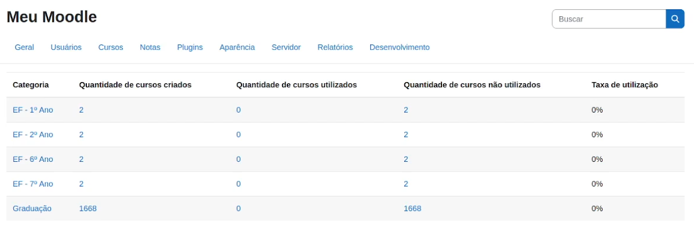
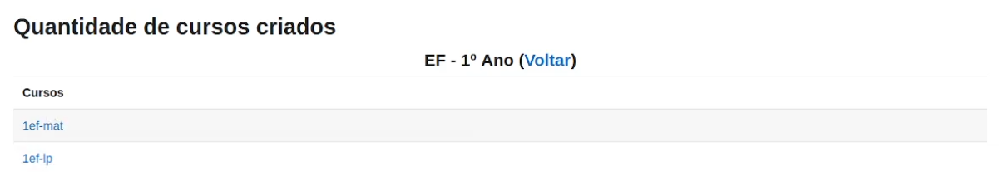
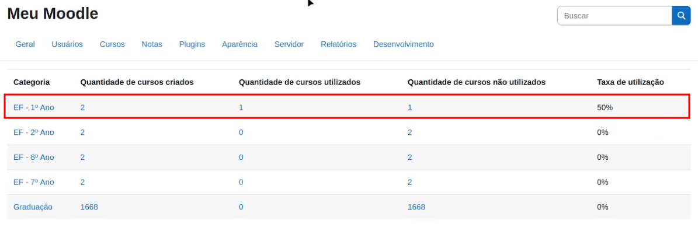
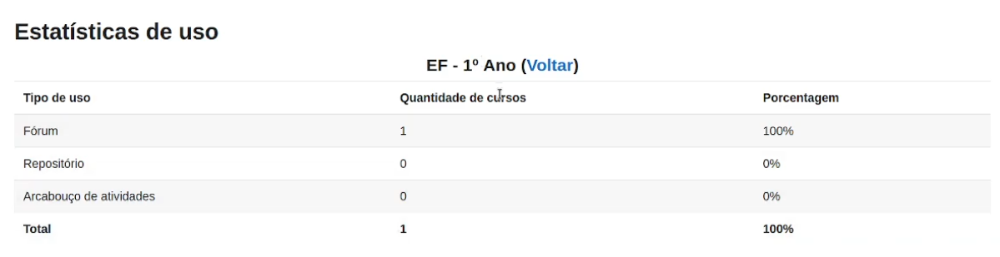

[Back](../README.md)

# Using the plugin for the first time

This tutorial provides a step-by-step guide on how to use the "CourseStats" plugin for the first time. The content is also available in format [video](https://www.youtube.com/watch?v=98T4p3GH8F8).

## 1. Accessing the plugin area
- After installing the plugin, go to the **Reports** tab and click on **Course Usage Statistics V2**. The plugin will load a list of categories registered in your Moodle.
- In the example presented in the video that accompanies this tutorial (Figure 1), a set of categories was created for testing, including **EF - 1st Year**, **EF - 2nd Year**, **EF - 6th Year**, and **EF - 9th Year**, each with only two courses. There was also a larger category, called **Graduation**, containing more than 1,600 courses.

*Figure 1: List of categories pre-registered in Moodle.*

## 2. Viewing Categories and Their Usage Rates
- When you access the plugin, you will notice (Figure 1) that it displays the usage rates for all categories with the value **0 (zero)**. This happens because the plugin only detects course usage after its installation.
- By clicking on the number of existing courses within a category (for example, **EF - 1st Year**), you will be able to view the list of courses in that category (Figure 2).

*Figure 2: List of courses in a category.*

## 3. Changing a Category's Usage Rate
- When you make any changes to a course (such as submitting a forum topic or adding an activity), the usage rate for the category where the course is located will be automatically updated.
- For example, when submitting a topic in the forum for the **1ef-mat** course, in the **EF - 1st Year** category, when you return to the plugin screen, you will see that the category's usage rate has increased to **50%** (Figure 3).
 
  

*Figure 3: New usage fee for the EF category - 1st Year.*

## 4. Displaying the Usage Type for Courses in a Category
- By clicking on the name of a category, the plugin will show the usage types for the courses in that category, which can be:
    - **Forum**: when the teacher only uses the course's announcements forum;
    - **Repository**: when the teacher only uses resources for hosting files in Moodle; or
    - **Activity Framework**: when the teacher uses other available modules in Moodle, such as Assignments, **Quizzes, among others.
- For example, assuming that the teacher of the **1ef-mat** course has only sent notices to students through the forum, the result for the **EF - 1º Ano** category will be as shown in Figure 4.
  

*Figure 4: Types of use of courses in the EF category - 1st Year.*

## 5. Finalizing the first use of the plugin
- The plugin allows you to view a list of created, used, and unused courses in each category. To do so, simply click on the number of courses corresponding to the one you want to view.
- The [next tutorial](config_file_explanation.md), will explain the anatomy of a plugin configuration file. This will allow you to adapt the plugin to your institution's specific needs.
